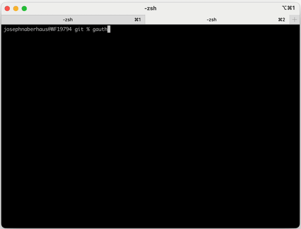

# gauthordle
Given a commit message, can you guess who wrote it?



New games come out at midnight Central Time. Each game is deterministically generated from your git history so everyone can play the same puzzle each day.

## How to play
To play, follow one of the installation guides below. After that, you can just navigate to any git repository, `git chekout` the main development branch, and then run `gauthordle` to start the game.

You might also want to `git pull` to ensure that your git history is up-to-date. Otherwise, you may end up playing the wrong game for the day. The program doesn't do this automatically because I didn't want it to make any changes to the file system.

### Installation from source (recommended)
With any version of [Golang](https://go.dev/) 1.21 or higher you can easily install from source:

```shell
go install github.com/josephnaberhaus/gauthordle@latest
```

### Installation from prebuilt binary
Download and extract the appropriate binary for your platform on the [releases page](https://github.com/JosephNaberhaus/gauthordle/releases).

## Configuration
You can optionally specify a config file at `~/.gauthordle.yaml`:

```yaml
author_filters: # (Optional) Allows you to filter out authors from the game.
  - exclude_name: "<regex of author names to exclude>"
  - exclude_name: "<another regex of author names to exclude>"
  - exclude_email: "<regex of author e-mails to exclude>"
  - exclude_email: "<another regex of author e-mails to exclude>"
teams: # (Optional) Specifies what teams should be available with the --team flag.
  your-team-name:
    - "<email address 1>"
    - "<email address 2>"
author_bias: 2.1 # (Optional) Specifies how much to bias towards high commit count authors.

```

The `author_filters` are useful for filtering out bots. Internally, guathordle attempts to automatically detect and remove bot-made commits, but it won't catch everything.

The `teams` option allows you to play a game with certain authors. Any team specified in your config can be select by the `--team` flag (e.g. `gauthordle --team your-team-name`).

The `author_bias` changes how much the randomness is biased toward high committers. A bigger bias increases the likelihood that the answer will be a high commit count author. The default value is 3.5 and the value must be in between 1 and 5. Setting it to 1 will remove the bias entirely.

**Note:** When using these options you won't get the same daily game as anyone who isn't using the same config file.